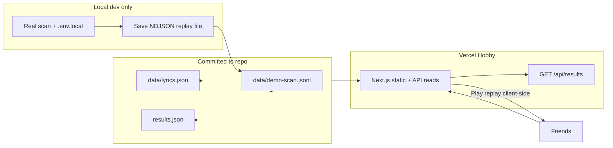

# Deploy Drake AI on Vercel (free demo)

Plan to host a **free, demo-only** build for friends. Watching the scan stream in the live log is part of the experience — but production does **not** run real LLM scans. Last updated: 2026-05-21.

## Goals (locked in)

| Goal | Approach |
|------|----------|
| **$0 hosting** | Vercel **Hobby** only — no Pro |
| **$0 API in prod** | No `ANTHROPIC_API_KEY` / `OPENROUTER_API_KEY` on Vercel |
| **Demo data** | Commit `data/lyrics.json` + `results.json` (final mentions everyone browses) |
| **Scan as theater** | Replay a **recorded** NDJSON event log locally captured once — same UI log/progress as a real run |

Real scans and lyrics sync stay on your machine (`npm run dev` + `.env.local`).

## What works out of the box

| Piece | Status |
|--------|--------|
| Next.js on Vercel | Native — no `vercel.json` required |
| Build | `npm run build` |
| Static demo files | Commit lyrics + results + replay log (see below) |
| Git remote | `origin` → GitHub (`seanjhannon/drake_ai`) |

## Why not live scans on Vercel Hobby

| Issue | Demo fix |
|-------|----------|
| **10s** serverless limit | Replay runs in the **browser** (or one short static file fetch) |
| **Ephemeral disk** | Don’t write `results.json` in prod — ship the finished file in git |
| **API cost / abuse** | No LLM keys in Vercel env; disable or guard live `/api/scan` in prod |

## Architecture (demo)

## Code changes to build (before or right after first deploy)

### 1. Ship seed data

- Remove `data/lyrics.json` and `results.json` from `.gitignore` (or force-add).
- Commit both; `results.json` is the **canonical** end state after the recorded scan.

### 2. Record a scan replay file

Once locally (same selection you want friends to “watch” — e.g. Take Care subset you already scanned):

1. Run a real extract with logging, **or** tee the stream to a file.
2. Save **one JSON object per line** (same format `/api/scan` already streams): `start`, `extract`, `friends`, `no_friends`, `progress`, `done`, etc.
3. Commit as e.g. `data/demo-scan.jsonl`.

Optional: add a small script that runs scan locally and writes `data/demo-scan.jsonl` for re-recording after catalog changes.

### 3. Demo mode in the UI

When `NEXT_PUBLIC_DEMO_MODE=true` (or no API keys detected):

- **Scan Mentions** (and any “sync lyrics” affordance) triggers **replay** instead of `fetch('/api/scan')`.
- Replay implementation (preferred): `fetch('/data/demo-scan.jsonl')` → parse lines → `setLog` / `setProgress` with `setTimeout` or `requestAnimationFrame` between events (match pacing of a real run, or slightly faster).
- On `done`, call existing `loadResults()` so the table matches committed `results.json` (don’t depend on prod writing disk).
- Label in UI: e.g. “Demo replay” so friends know it’s not live AI.

### 4. Guard live routes in production

- `GET /api/results` — keep (reads committed `results.json`).
- `GET /api/lyrics` — keep (reads committed `data/lyrics.json`).
- `POST /api/scan`, `POST /api/lyrics` — return **403** when `DEMO_MODE=true` or keys missing (belt-and-suspenders).

No API keys in Vercel env vars.

### 5. Optional polish

- Hide/disable album picker actions that only make sense for a live full-catalog run, **or** map selection to the same scoped replay every time.
- Password-free public URL is fine for a demo; optional Vercel password if you want a smaller audience.

## Deploy checklist (Hobby, ~30 min)

### Phase 1 — Repo

- [ ] Implement demo replay + prod guards (above)
- [ ] Record `data/demo-scan.jsonl` from local scan
- [ ] Commit `data/lyrics.json`, `results.json`, `data/demo-scan.jsonl`
- [ ] `npm run build`
- [ ] Push `main`

### Phase 2 — Vercel

- [ ] Import `seanjhannon/drake_ai` on [vercel.com](https://vercel.com)
- [ ] **Environment variables** (Production):

  | Variable | Value |
  |----------|--------|
  | `NEXT_PUBLIC_DEMO_MODE` | `true` |
  | `DEMO_MODE` | `true` (server guard on POST routes) |

  Do **not** set `ANTHROPIC_API_KEY` or `OPENROUTER_API_KEY`.

- [ ] Deploy

### Phase 3 — Smoke test

- [ ] Landing page shows lyrics + results counts from committed files
- [ ] Click scan → live log animates → progress bar moves → ends at 100%
- [ ] Final friends table matches `results.json`
- [ ] Refresh page → results still there (from git, not ephemeral writes)
- [ ] `POST /api/scan` returns 403 (curl or network tab)

### Phase 4 — Share

- [ ] Send friends the `.vercel.app` URL
- [ ] Document for yourself: re-record replay + refresh `results.json` when you change the demo selection

## Local vs production

| Capability | Local (`npm run dev`) | Vercel demo |
|------------|----------------------|-------------|
| Sync lyrics (lrclib) | Yes | No (pre-shipped) |
| Live LLM scan | Yes (needs `.env.local`) | No |
| Watch scan run | Yes (live) | Yes (**replay**) |
| Browse mentions | Yes | Yes (committed `results.json`) |

## Out of scope for this deploy

These were in the earlier plan but **not** needed for free demo:

- Vercel Pro / 300s functions
- Vercel Blob / KV
- OpenRouter spend limits in prod
- Chunked real scans for multi-user persistence

Revisit only if you later want a paid, interactive production app.

## Suggested implementation order

1. Commit lyrics + results
2. Record `demo-scan.jsonl` locally
3. Client-side replay + `NEXT_PUBLIC_DEMO_MODE`
4. Block live POST routes when `DEMO_MODE`
5. Deploy to Hobby and smoke-test the replay UX
